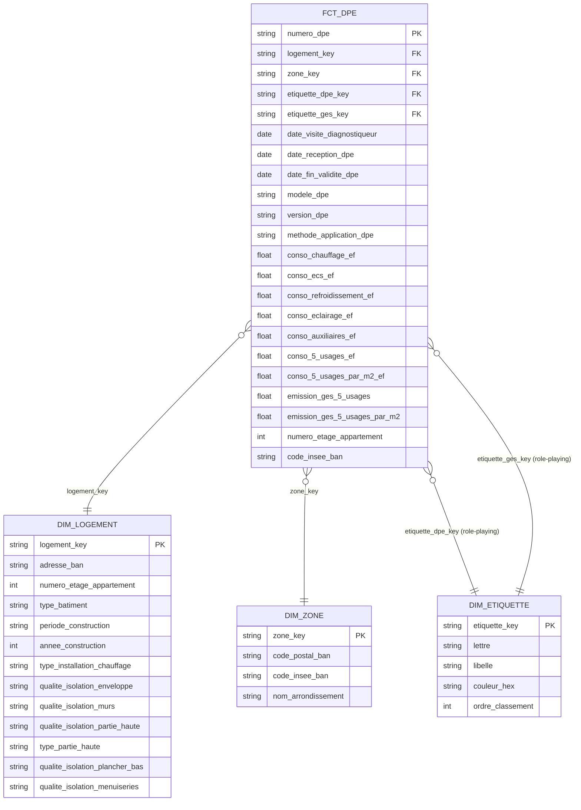

# DPE Logements existants — Analytics dbt

Projet dbt en cours de construction sur le Diagnostic de Performance Énergétique des logements existants sur l'année 2025 à Paris.

Le DPE est au cœur de l'actualité française afin de réduire les émissions de CO2 et la consommation d'énergie en France. 

**Source** : https://data.ademe.fr/datasets/dpe03existant.

## Stack

- Python 3.10.12(pandas, sqlalchemy, psycopg2-binary)
- dbt Core 1.11.7
- PostgreSQL 15 (Docker)

## Structure du projet

- `data/`                  Données brutes téléchargées (CSV de ADEME)
- `dbt_project/`           Projet dbt
- `exploration.md`         Notes d'exploration du dataset
- `loader.py`              Lecture du CSV local téléchargé manuellement depuis ADEME
- `main.py`                Point d'entrée du pipeline d'ingestion
- `docker-compose.yml`     PostgreSQL local
- `requirements.txt`       Dépendances Python
- `docs`                   Documentations 

## Installation

1. Cloner le repo
```bash
git clone https://github.com/valentino014/dpe-logement-existant.git
cd dpe-logement-existant
python3 -m venv venv
# Linux/Mac
# source venv/bin/activate
# Windows
venv\Scripts\activate
```

2. Installer les dépendances:
```bash
pip install -r requirements.txt
```

3. Télécharger le CSV depuis ADEME :
   - Aller sur https://data.ademe.fr/datasets/dpe03existant
   - Ouvrir la vue tabulaire
   - Appliquer les filtres : `code_departement_ban = 75`, `date_visite_diagnostiqueur` entre `2025-01-01` et `2025-12-31`
   - Exporter en CSV et placer le fichier dans `data/dpe03existant.csv`

4. Configurer les variables d'environnement :
```bash
cp .env.example .env
# Éditer .env si besoin (par défaut: postgres / postgres / projet1_db)
```

5. Lancer PostgreSQL:
```bash
docker compose up -d
```

6. Ouvrir postgreSQL en ligne de commande :
```bash
docker exec -it projet1_postgres psql -U postgres -d projet1_db
```

7. Lancer python:
```bash
python3 main.py
```
Ce script lit `data/dpe03existant.csv`, le transforme et l'insère dans la table `raw.dpe` de Postgres (peut prendre 1-2 min).

8. Installer les packages dbt :
```bash
cd dbt_project
dbt deps
```

9. Configurer la connexion dbt :
   Vérifier que `~/.dbt/profiles.yml` est configuré pour pointer vers ton Postgres local. Exemple :
```yaml
dpe_project:
  outputs:
    dev:
      type: postgres
      host: localhost
      port: 5433
      user: postgres
      password: postgres
      dbname: projet1_db
      schema: dbt
      threads: 4
  target: dev
```

10. Construire et tester le projet :
```bash
dbt build
``` 

## Vérification

```bash
dbt docs generate
dbt docs serve
```

## Exemples de requêtes business

### Q5 — Distribution des étiquettes DPE par arrondissement parisien

```sql
select
	de.lettre,
	dz.nom_arrondissement,
	count(*) as nb_dpe
from fct_dpe fd
inner join dim_etiquette de on fd.etiquette_dpe_key = de.etiquette_key
inner join dim_zone dz on fd.zone_key = dz.zone_key
group by nom_arrondissement, de.lettre
order by de.lettre, dz.nom_arrondissement
limit 150
```
<!-- TODO AUTRE QUESTION -->

## Décisions techniques

- J'ai choisi de faire une degenerate dim avec dpe car il n'y avait pas beaucoup d'attributs descriptifs. De plus, je voulais garder cela simple. 
- Role-playing sur la `dim_etiquette` afin de réutiliser celle-ci pour les étiquettes DPE et GES

### Limites assumées
- **Périmètre géographique** : Paris uniquement (arrondissements 75101-75120).
- **Annee_construction n'est pas utilisée** : ~50% de NULL dans la source ADEME, remplacée par `periode_construction` qui est plus fiable.
- **Pas de gestion des SCD type 2** : `dim_logement` est en SCD type 1 (écrasement). Si un logement change de `type_batiment`, l'historique est perdu.

## Schéma en étoile



## Documentation

Documentation du DAG de ce projet : 

## Ce que j'ai appris

- Mise en place de PostgreSQL isolé via Docker Compose (port 5433 pour éviter des conflits avec un autre projet)
- Ingestion d'un CSV volumineux (~175k lignes et 254 colonnes) à l'aide de pandas et chunksize pour gérer la mémoire
- Structuration d'un projet dbt séparant données brutes (`raw.*`) et modélisation 
- Ajout de test pour valider les données
- Utilisation du pattern Kimball Role-playing pour la gestion des étiquettes 

